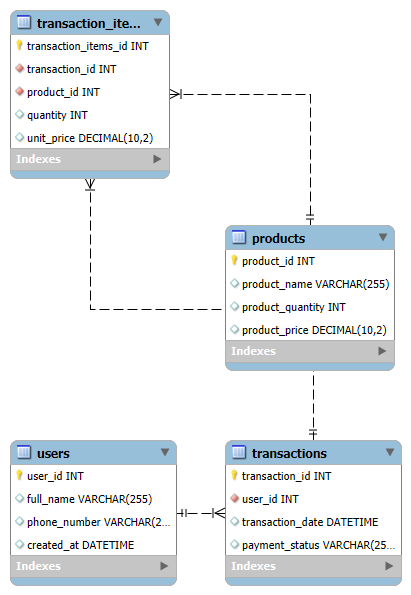
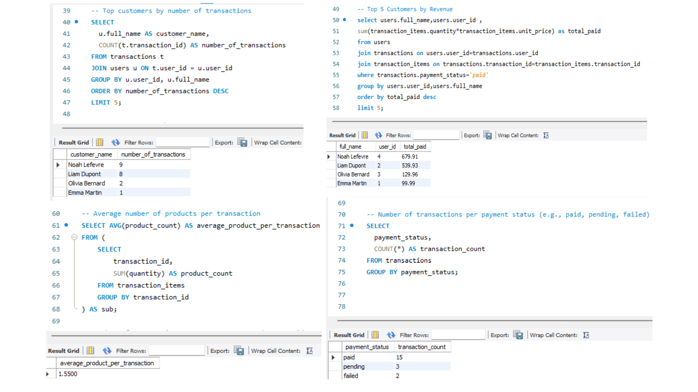

# CRM SQL Analytics Dashboard

This project simulates a mini CRM database and showcases key SQL skills through structured data, complex relationships, and business-oriented KPIs.

## 🚀 Project Overview

- Built a relational SQL database for a simplified CRM.
- Seeded realistic data for users, products, transactions, and transaction items.
- Created SQL queries to extract valuable business insights (KPIs).
- Ideal for practicing JOINs, GROUP BY, aggregations, filtering, and reporting logic.

## 🎯 Use Cases / Learning Goals

- Practice SQL for business intelligence and reporting
- Learn data aggregation using `GROUP BY`, `JOIN`, `HAVING`, and subqueries
- Understand schema design and seed realistic test data
- Create a base for dashboards or data visualization tools (e.g., Tableau, Power BI)

## 🗃️ Database Schema

- `Users`: Customer information (ID, name, contact)
- `Products`: Product catalog (ID, name, price, quantity)
- `Transactions`: Purchases made by users (ID, user, date, payment status)
- `Transaction_Items`: Line-items per transaction (product, quantity, unit price)

## 📊 KPIs Implemented

- Total number of customers
- Total revenue from paid transactions
- Number of transactions per day
- Most sold product
- Top customers by revenue
- Average number of products per transaction
- Payment status breakdown

Each KPI query is available in the file: `kpis.sql`.

## 🛠️ How to Run This Project

1. Import all `.sql` files into your MySQL environment (Workbench, CLI, or DBeaver).
2. Run the scripts in this order:
   - `create_tables.sql`
   - `seed_users.sql`
   - `seed_products.sql`
   - `seed_transactions.sql`
   - `seed_transaction_items.sql`
   - `kpis.sql`
3. You can also run them all at once using `init.sql`.

## 💡 Tools Used

- MySQL 8.x
- MySQL Workbench
- Visual Studio Code (optional for editing)

## 📊 KPI Results – Example Screenshots

Below are example results from the SQL analytics dashboard.

## 🗺️ Database Schema Diagram

### ✅ All KPI Results - Part 1

### ✅ All KPI Results - Part 2

